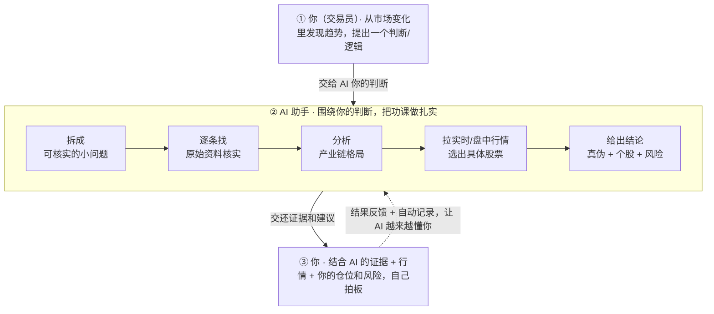

# AlphaLoop · 人机投研闭环

### 一套给你和 AI 的「投资研究协作流程」：你出方向，AI 帮你查证、取数、选股、记账，决策权永远归你。

AlphaLoop 不是又一个"问答机器人"，而是一套**人机分工的工作流程**——它规定了在做投资研究时，**哪些事归你、哪些事归 AI、用什么顺序协作**。装上之后，你的 AI 助手（Claude、Cursor、Codex 等）会按这套流程帮你把研究做扎实，而不是顺着你说话。

> 不需要会编程。会复制粘贴一行命令，就能用。

---

## 它要解决的痛点

如果你关注股票、加密货币、行业趋势，下面这些场景你一定不陌生：

- 你和 AI 聊投资，**全凭即兴发挥**——没有章法、想到哪问到哪，质量全看运气。
- 群里转来"重磅消息"、研报截图、大 V 小作文，你问 AI，它**顺着往下吹**，一句没核实，谣言反被加工放大。
- AI 报的股价、估值经常是**几个月前的旧数据**，拿去做判断就是错的。
- 每次都从零开始，AI **记不住**你研究过什么，成果留不下来、攒不起来。

**根子上的问题：没有流程，且分工错了。** 很多人把 AI 当"替我做判断的大脑"，但 AI 不擅长判断方向，它擅长的是**不知疲倦地查证、取数、记录**。

AlphaLoop 给你和 AI 立一套规矩——让人做人擅长的，让 AI 做 AI 擅长的，并把它固化成可复用的流程。

---

## 核心：一套三步协作流程 + 反馈闭环

这是 AlphaLoop 的灵魂。一切能力都是为了让这套流程跑得又快又靠谱。



- **① 你出方向**：你提一个判断或逻辑（比如"我觉得某趋势会沿这条链传导"）。这是人最擅长、AI 替代不了的部分。
- **② AI 把功课做扎实**：AI 把你的判断**默认当成"还没证实的假设"**，然后一条条核实、拉行情、按产业链选股，最后给你一份"哪些真、哪些假、哪些存疑 + 相关个股 + 风险"的清单。
- **③ 你拍板**：AI 只给证据和风险，**买不买、买多少，永远是你决定**。
- **🔁 闭环**：你的决策结果会被记录、反馈回去，让 AI 越来越懂你的判断风格。

（更细的讲解见 [工作流详解](docs/workflow.md)；一个真实案例走查见 [案例走查](docs/case-study.md)。）

---

## 围绕这套流程，配了这些能力

流程是骨架，下面这些能力是为流程的每一步服务的"工具箱"：

- **🔍 自动事实核查**（服务流程第②步）：把任何二手消息（推文、研报、截图、"另一个 AI 说的"）拆成一条条小声明，逐条找**原始出处**（公司公告、财报、官方文件）核实，并打标签：✅ 证实 / 🟡 部分属实 / 🔴 错误 / ⚠️ 查不到。
- **📈 实时 & 盘中行情查询**（服务流程第②步）：涉及股价、估值、涨跌幅时自动拉**最新行情**，交易时段可查**盘中实时价**，全部标注时间和来源；自带一批**免费、不用申请密钥**的行情源，覆盖 A股 / 港股 / 美股 / 加密货币 / 大宗商品。
- **🧠 会自动保存的研究知识库**（服务闭环）：每次对话产生的研究结论、核实结果、决策，**自动写进你本地的知识库并记一条时间线日志**，越攒越厚、跨对话复用——不用你手动整理，也不用每次从零开始。
- **⛓️ 产业链分析框架**（服务流程第②步）：遇到原材料、卡脖子、出口管制这类话题，用一套结构化方法（供需 → 谁掌握资源 → 国产替代到哪一步 → 是不是 AI 等高景气需求 → 受益股票）帮你理清格局、落到标的。
- **📓 交易记账与归因**（服务闭环）：把每笔交易和它背后的"判断理由"记下来，方便日后复盘——哪类判断你总做对、哪类总做错，让经验可量化。
- **🛠️ 不轻易甩锅**：抓不到网页、查不到数据时，AI 会自己换方法再试，而不是动不动停下来问你。
- **🔌 一次安装，多家 AI 通用**：支持 Claude Code、Cursor、Codex CLI 等主流 AI 助手，一个命令全装好。

---

## 流程跑起来长什么样（前后对比）

**没装之前**（没有流程，AI 顺着你吹）：

> 你：这条消息说某材料一年涨了 100 倍，相关股票要起飞，对吗？
> AI：是的！这是一个巨大的机会，因为供需紧张……（然后开始编故事）

**装上 AlphaLoop 之后**（按流程把功课做扎实）：

> 你：这条消息说某材料一年涨了 100 倍，相关股票要起飞，对吗？
> AI：我先把这条当成"待验证的说法"，拆成几个可核实的点 →
> ✅ "海外涨了约 100 倍"——查到行业报价机构数据，**属实**；
> 🟡 但这是**海外价**，国内只涨了几成，国内矿企其实吃不到这个差价；
> 🔴 消息里把另一种材料也归到一起了，其实逻辑是两回事；
> 这是相关个股的**最新/盘中股价**（附时间和来源）和风险点。**买不买你定，我把证据摆给你。**
> （这次研究的结论已自动存进你的知识库。）

---

## 你能得到的好处

- **研究有章法**：从"即兴问答"升级为"有固定流程的研究"，质量稳定，不靠运气。
- **少踩坑**：谣言、过时数据、张冠李戴、夸大其词——这些最容易让人亏钱的信息陷阱，AI 会帮你拦下来。
- **省时间**：翻公告、查财报、对盘中行情的体力活交给 AI 批量做，你只看结论。
- **决策权牢牢在自己手里**：AI 只给证据和风险，**绝不替你下单、不替你决定买多少**。
- **越用越聪明**：研究成果自动沉淀、复利，你的"研究资产"随时间增值，而不是聊完就忘。
- **隐私安全**：所有研究数据都存在你自己电脑上，不上传、不联网"打小报告"。

---

## 适合谁

- 关注股票 / 加密货币 / 行业趋势，经常被各种"消息""小作文"轰炸、想要一套靠谱研究流程的人。
- 想让 AI 当一个**有章法的研究助理**，而不是一个**讨好你的复读机**的人。
- 记者、学生、研究者，以及任何"读到太好的消息会本能怀疑、想要一个快速核实办法"的人。

不用懂代码。能复制粘贴一行命令，你就能用。

---

## 快速安装（3 步）

适用于支持 "skills"（AI 技能插件）的助手，如 Claude Code、Cursor、Codex CLI 等。

```bash
git clone https://github.com/realnaka/alphaloop.git
cd alphaloop
./install.sh
```

安装脚本会**自动识别**你电脑上装了哪些 AI 助手，把整套技能装到对应位置，并在 `~/openorder/` 建一个空的研究知识库（只放模板，不含任何真实数据）。

其它用法：

```bash
./install.sh --dry-run        # 先看看它会做什么，不实际改动
./install.sh --uninstall      # 一键卸载（你的知识库不受影响）
./install.sh --home ~/我的知识库   # 自定义知识库存放位置
```

装完后，开一个新对话，把一段投资逻辑、一张研报截图丢给它，或者直接问一只股票——它就会自动按上面的流程帮你查证、取数、选股，并把结论记下来。

---

## 隐私与边界（请放心）

- **这个仓库只发"方法/流程"，不发"数据"**：里面只有工作流程和空模板，**没有**任何真实研究内容、持仓、盈亏、API 密钥或私人表格。
- 你的知识库内容只存在**你自己的电脑**上（`~/openorder/`），**永远不会**进入这个公开仓库。
- 需要密钥的行情源（如 Finnhub/FMP）请把密钥放进环境变量；不想申请也没关系，套件自带**免密钥**的行情源。
- AlphaLoop **不替你做决策、不替你下单**——它只给你证据、个股和风险，最后拍板的永远是你。

---

## 不止能用于股票

这套"人出方向、AI 查证、人决策"的流程并不绑定股票——加密研究、生物医药、房产分析都能套用。只要把里面的"分析框架"换成你领域的判断方式即可。怎么改见 [如何换成自己的领域](docs/customize.md)。

---

## 致谢

知识库部分（[`openorder`](skills/openorder/SKILL.md)）的设计受 Andrej Karpathy 的 [LLM Wiki 模式](https://gist.github.com/karpathy/442a6bf555914893e9891c11519de94f) 启发。

## 开源协议

[MIT](LICENSE) —— 自由使用、分享、二次开发。
